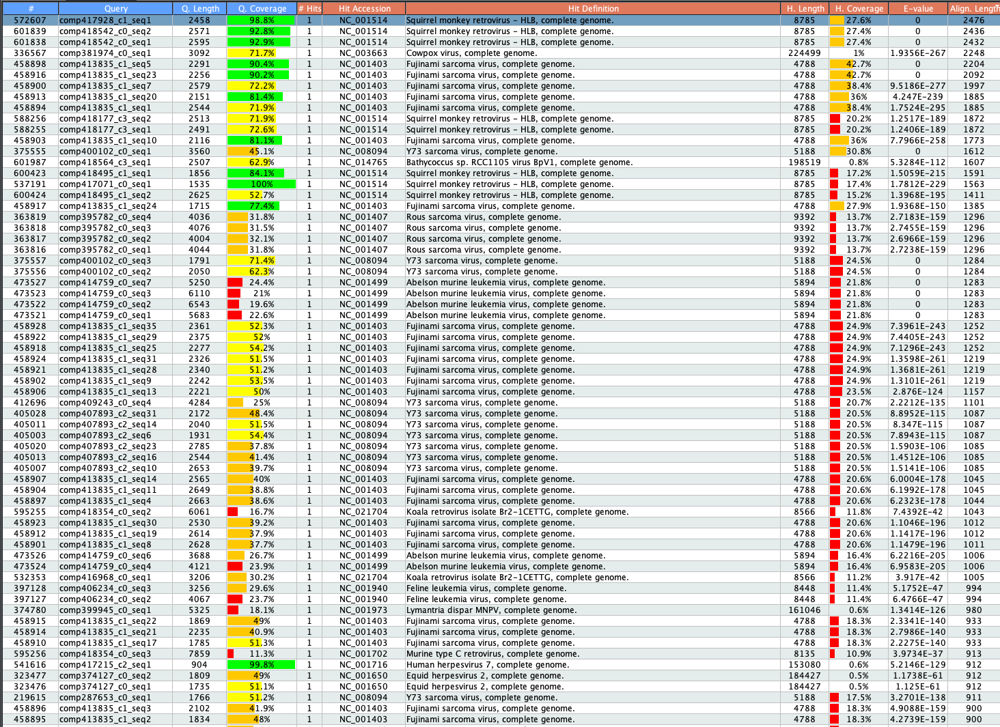

```{r setup, include=FALSE}
knitr::opts_chunk$set(echo = TRUE)
```

# Background

In initial analyses, the Schountz lab stimulated spleen cells from a bat for 24 and 48 hours with con-A/PWM, then did RNA-seq and de novo transcriptome assembly. When they compared their transcriptome against a viral database, they found multiple retrovirus sequences. They suspect that most are endogenous retroviruses that are getting expressed by mitogen stimulation. This analysis was done with ngKLAST, a BLAST GUI program that is no longer available. The highest alignment was to Squirrel monkey retrovirus.

This analysis was done using a de novo Trinity assembly, but there are now multiple high-quality genomes available:

- [WHU_Ajam_2](https://www.ncbi.nlm.nih.gov/data-hub/genome/GCF_014825515.1/), the reference genome
- [CSHL_Jam_final](https://www.ncbi.nlm.nih.gov/data-hub/genome/GCA_021234435.1/), the newest genome, which Tony suggested because the CSHL lab group says it's the best
- [ArtJam_v1_BIUU](https://www.ncbi.nlm.nih.gov/data-hub/genome/GCA_004027435.1/)

Tony recommends the CSHL assembly, however the annotation on NCBI is not nearly as complete as the NCBI reference. Perhaps he recommends because newer and better sequencing technology used? He also sent me an associated gff and gtf, which were not available through NCBI.

Because there are now complete genomes, it will be best to re-run all analyses.

# Questions

1. Can we recapitulate the retroviral sequence alignments found by the Schountz lab?
1. Are the retroviral-like sequences endogenous or exogenous?
1. Does retroviral expression shift with individual, tissue, or disease status?

We will work on answering questions 1 and 2 in tandem. Question 1 will be answered by re-running an RNA-seq pipeline with alignment and quantification to a genome instead of de novo transcriptome assembly. Question 2 will be answered by designing a qPCR assay to quantify gene copy number. Question 3 will be answered by examining gene expression in additional samples and tissues, which will likely require additional sequencing.

<br>

----

# qPCR assay design

## 1. Identifying putative retrovirus target genes

The first step for determining if the sequences are exogenous or endogenous is to identify an appropriate target sequence for qPCR. Approach for identifying presumptive ERV sequence:

1. Search Genbank for any ERV *A. jamaicensis* sequences.
1. BLAST the Schountz lab de novo contigs that previously had high alignment in ngKLAST.
1. Examine sequences and alignment in Geneious.

### Genbank search

A keyword search for 'retrovirus' revealed the ["endogenous retrovirus group K member 5 Gag polyprotein-like" gene](https://www.ncbi.nlm.nih.gov/gene/119053278). This gene is annotated in the NCBI reference genome, WHU_Ajam_v2. Specifically, it's a computationally predicted protein based on the NCBI alignment pipeline. The gene is not annotated in the newer CSHL genome, where all of the annotations are structured as 'gene name-like.'

### Schountz lab contigs with high retrovirus alignment

Unfortunately, I only have a screenshot of the top ngKLAST results:



To confirm alignments to the new genomes, I:

1. Took the top 10 contigs with the highest alignment by length and % query coverage (between 100-77.4%) from Tony's screenshot
1. Blasted each:
    - To the nr protein database
    - Against only the Ajam reference genome (Megablast)
    - Against only the CSHL genome (Megablast)
1. Confirmed that these alignments were to similar genes (e.g. Squirrel monkey retrovirus) as in the ngKLAST results
1. Checked whether the transcriptome contigs and the top results from the Ajam reference genome alignment blasted to the same CSHL genome region

For example, blastx of comp417928_c1_seq1 shows that it has the highest e-value hit (0) to the Squirrel monkey retrovirus. However, it also has highest % identity (83.25%) to the A. jamaicensis "endogenous retrovirus group K member 5 Gag polyprotein-like" gene. When I blast the contig against only the Ajam reference genome, this gene is again the top hit. When I blast it against the CSHL genome, there is no hit. However, when I blast the reference genome gene (XP_037006647.1) against the CSHL genome, I do get good alignment. The blast results for the other contigs vs. the Ajam genome blast results were similarly not identical. I think this is likely because transcriptome assembly is error-prone, and I'm not going to worry about it. For now, we will continue with using the blast results according to the Ajam reference genome, then double-checking that those genes have high alignment within the CSHL genome as well.

See the full list of blast results [here](transcriptome_blast.xlsx).

### Results

Based on NCBI keyword search and contig blast results, there are two genes that seem like good candidates. The first is the predicted endogenous retrovirus gene, which was also picked up as a blast result for one of the contigs. The second is a predicted tyrosine kinase, but it also has domains found in feline sarcoma virus and fujinami virus). The majority of the contigs had nr protein database blast results similar to the original ngKLAST output (e.g. squirrel monkey retrovirus, genes related to fujinami virus).

## 2. Identify appropriate housekeeping gene.

To determine whether the target genes are endogenous or exogenous, we need to compare copy number to a housekeeping gene that has one copy per cell. If the retrovirus has ≥ copies than the housekeeping gene, it is likely endogenous. If it has fewer copies than the housekeeping gene, this indicates that it is not present in every cell, which suggests that it is an exogenous virus that has infected some cells, but not all. GAPDH is a common housekeeping gene used in many taxa.

Brittany did a literature search to see what housekeeping genes are typically used in *A. jamaicensis* and other bat qPCR assays. She found that GAPDH, EEP2, and HPRT are consistently used. I emailed Tony to get his input, and he said they had used GAPDH consistently in their lab. Because they've used this gene successfully, we will start with the primers his lab has already generated.

## 3. Primer design in Geneious

After identifying potential target genes and an appropriate housekeeping gene, we imported them to Geneious for primer design.

### GAPDH primers

I added the GAPDH forward and reverse primers from Tony to the *A. jamaicensis* GAPDH gene (GeneID:119060182). I then extracted this amplicon region, and aligned it to the CSHL genome to confirm that a) the primers are specific to one region, and b) that there are not SNPs.

__Results:__ The primers are specific to one region in the CSHL genome. However, there is one SNP in the R primer (A/T), and two in the F primer (A/C and G/C). Since these primers have worked for the Schountz lab, we'll go ahead and order them without degenerate bases, but this might be something to consider if they don't work.

### ERV group k member 5 primers

We will optimize primers for this gene by trying a set of three f/r primers. In designing primers, we shoot for:

1. An amplicon size <200 bp
1. A Tm of ~60º
1. Primer sequences that are specific to one region
1. Primer sequences without degenerate bases.

We first identify primer pairs using the 'Design New Primers' function in Geneious. Once we have three candidate pairs, I then extracted the amplicons and aligned them back to the CSHL genome as above. This confirms that the primers are specific, and that there are not SNPs in the primer sequence.

__Results:__

Primer set 1: ERV 756 F + ERV 835 R
Primer set 2: ERV 1070 F + ERV 1179 R
Primer set 3: ERV 1344 F + ERV 1456 R

See primer list and sequences [here.](ERVprimers.xlsx)

### tyrosine kinase primers

If optimization for the ERV gene doesn't work, we will try primers targeting this gene instead.

<br>

----

# RNA-seq pipeline

